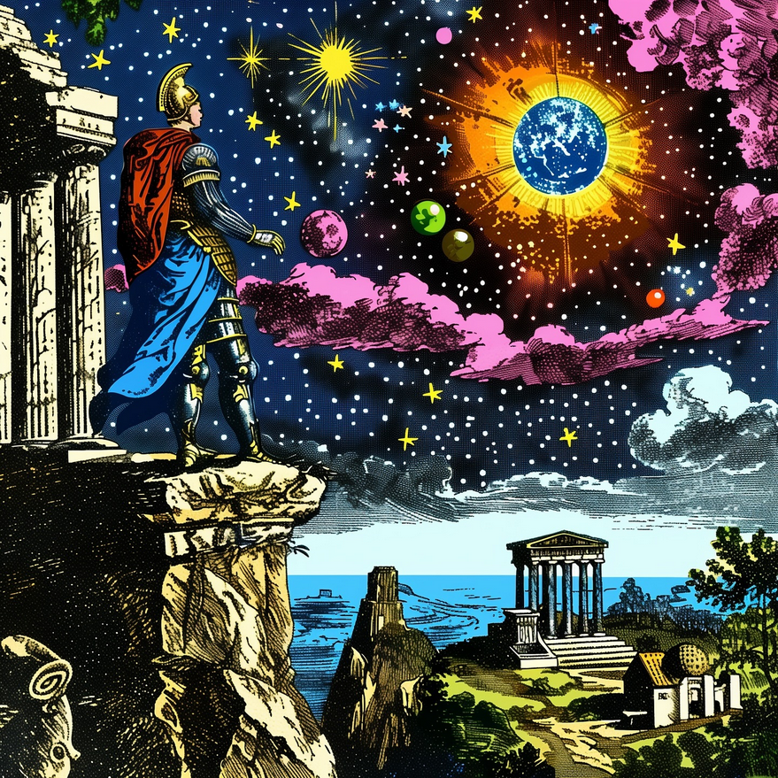
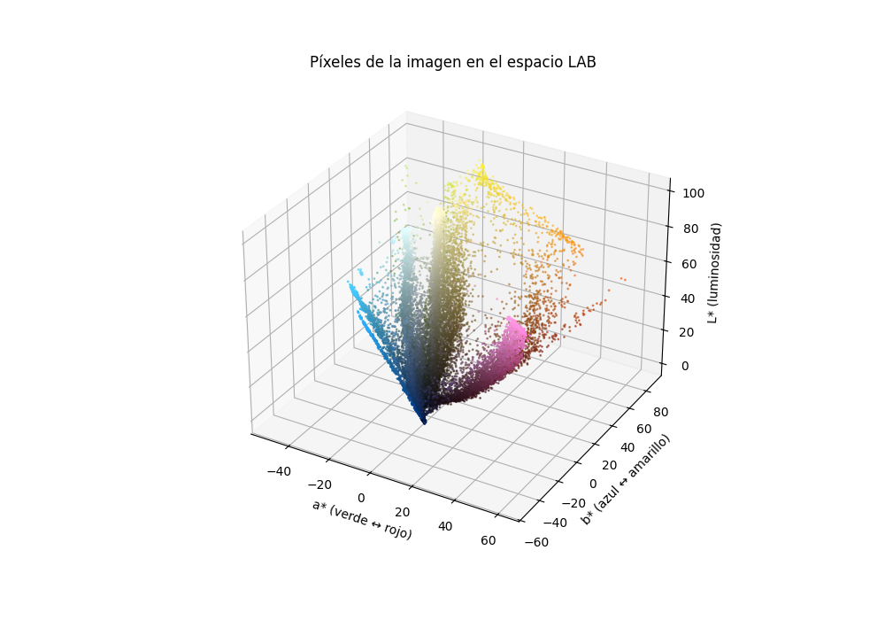
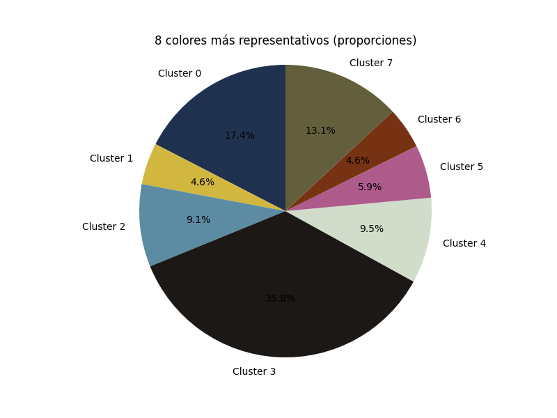
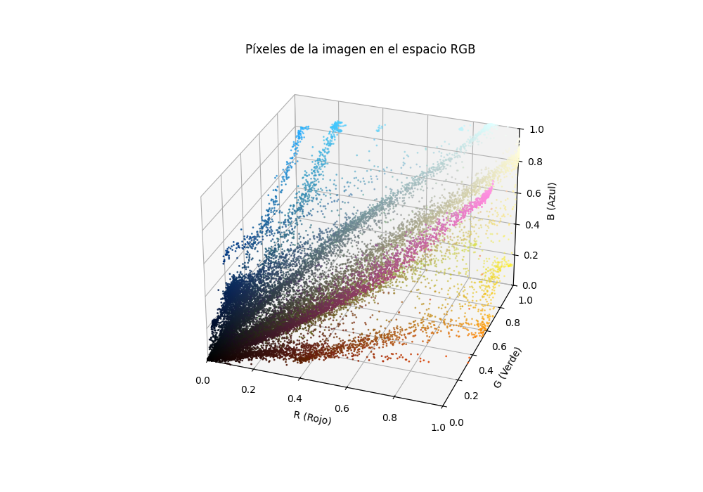
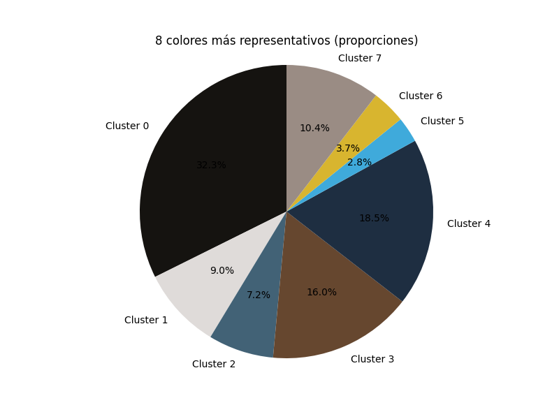
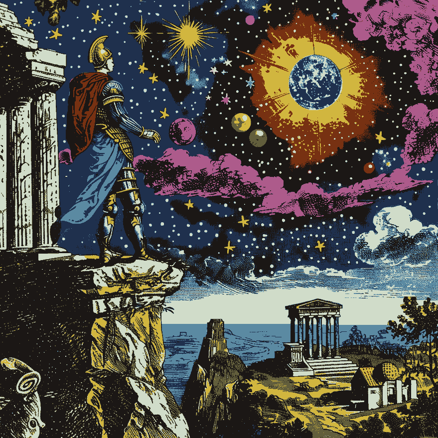
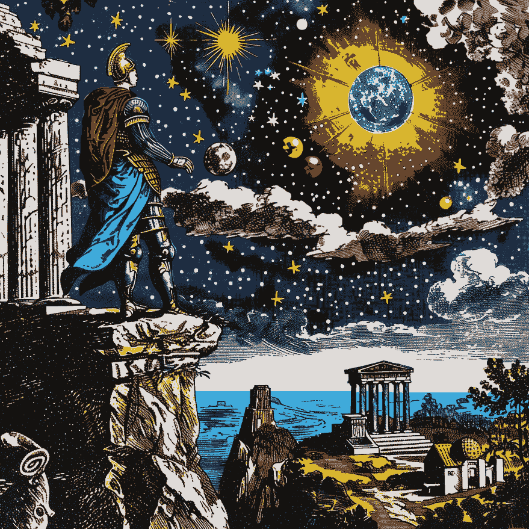

# Image-Color-Extraction

Hace poco tuve las ganas de experimentar con algoritmos de [dithering](http://alex-charlton.com/posts/Dithering_on_the_GPU/) para imagenes. Siempre me meto de cabeza al tema pero me termino desviando, y esta no fue la excepcion.

Cuando se hace dithering se limita la paleta de colores, a veces se la selecciona con un proposito experimental para ver combinaciones llamativas y extravagantes. Otras veces se busca los colores que van a hacer que la imagen con dithering se parezca lo mas posible a la original.

De ahi vino mi pregunta, cuales son dichos colores? o mas bien, cuales son los k colores mas representativos de una imagen? Necesitamos tener una buena nocion de cercania entre colores para poder agruparlos... chatgpt me recomendo usar el espacio de colores LAB por sobre RGB, voy a probar con los 2, pero primero con LAB. Voy a usar un algoritmo de agrupamiento como [K-means](https://www.youtube.com/watch?v=4b5d3muPQmA&t=182s&ab_channel=StatQuestwithJoshStarmer) para identificar los k clusters de colores mas representativos.

### Imagen de Prueba:
  

## LAB

## RGB

## Naive Dithering

Consiste en reemplazar cada color de la imagen por el mas cercano de nuestra paleta de colores (en este caso la obtenida con k-means)

### Paleta LAB

### Paleta RGB

